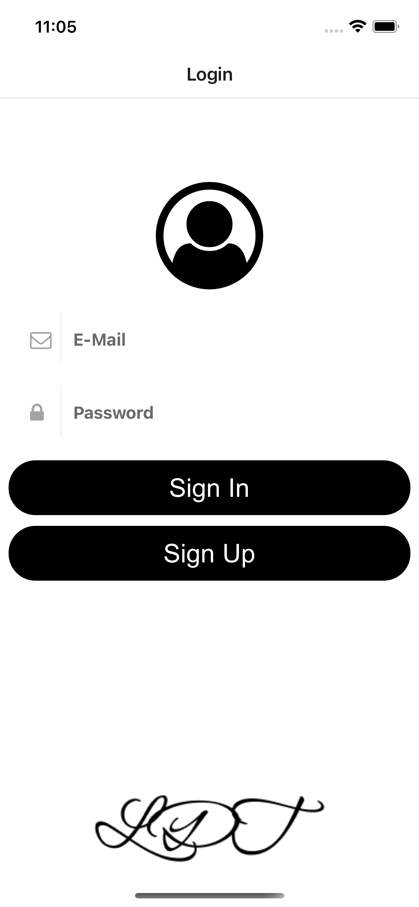
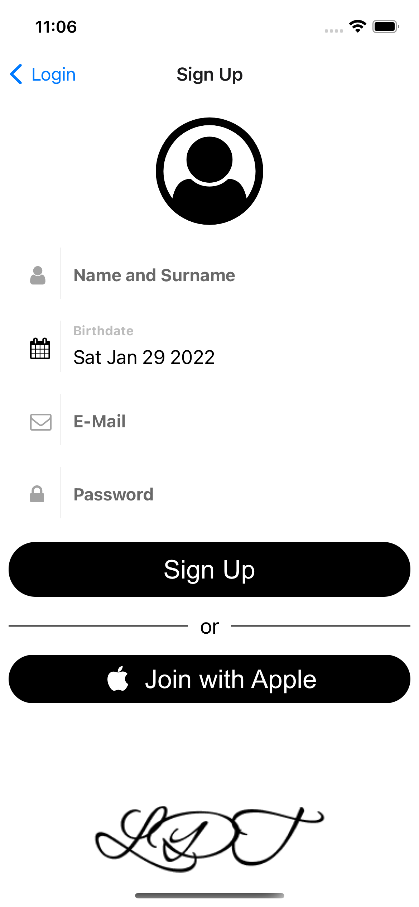
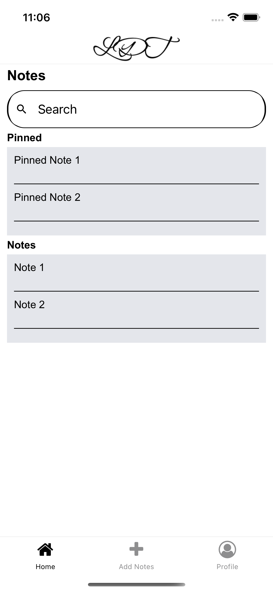
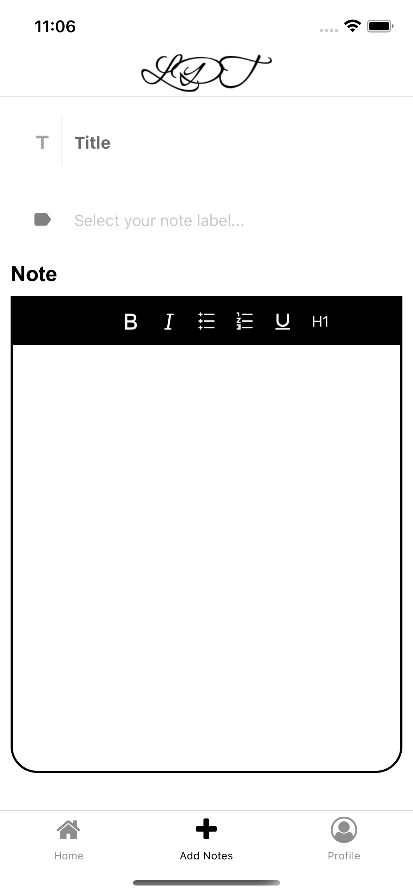
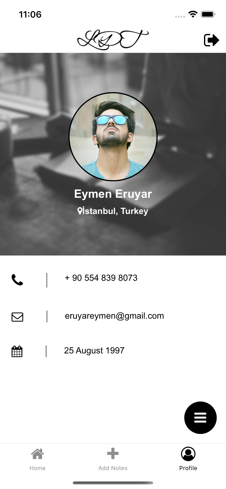

<!-- PROJECT LOGO -->
<br />
<div align="center">
  <a href="https://github.com/eymeneruyar/LDT">
    
  </a>

  <h3 align="center">LDT Note App</h3>

  <p align="center">
    A great app for keeping your notes!
    <br />
    <a href="https://github.com/eymeneruyar/LDT"><strong>Explore the docs »</strong></a>
    <br />
  </p>
</div>

<!-- TABLE OF CONTENTS -->
<details>
  <summary>Table of Contents</summary>
  <ol>
    <li>
      <a href="#about-the-project">About The Project</a>
      <ul>
        <li><a href="#built-with">Built With</a></li>
      </ul>
    </li>
    <li>
      <a href="#getting-started">Getting Started</a>
      <ul>
        <li><a href="#installation">Installation</a></li>
      </ul>
    </li>
    <li><a href="#roadmap">Roadmap</a></li>
    <li><a href="#license">License</a></li>
    <li><a href="#contact">Contact</a></li>
  </ol>
</details>

<!-- ABOUT THE PROJECT -->
## About The Project

<a href="https://github.com/eymeneruyar/LDT/blob/main/images/1.png"></a>
<a href="https://github.com/eymeneruyar/LDT/blob/main/images/2.png"></a>
<a href="https://github.com/eymeneruyar/LDT/blob/main/images/3.png"></a>
<a href="https://github.com/eymeneruyar/LDT/blob/main/images/4.png"></a>
<a href="https://github.com/eymeneruyar/LDT/blob/main/images/5.png"></a>
<a href="https://github.com/eymeneruyar/LDT/blob/main/images/6.png"></a>


LDT application is a mobile application interface project where you can store your notes. There are 6 screens in the application; login, register, home, add note, profile, change password. The main purpose of the application is to create a secure platform where users can store their notes.


## Built With

The following technologies were used while developing the LDT mobile application.

* [](https://docs.npmjs.com/downloading-and-installing-node-js-and-npm)
* [](https://github.com/react-native-community/react-native-template-typescript)
* [](https://github.com/facebook/react)
* [](https://github.com/react-native-elements/react-native-elements)
* [](https://github.com/react-navigation/react-navigation)
* [](https://github.com/wxik/react-native-rich-editor)
* [](https://github.com/jondot/awesome-react-native)
* [](https://github.com/microsoft/TypeScript)

<p align="right">(<a href="#top">back to top</a>)</p>

## Installation


1. Clone the repo
   ```sh
   git clone https://github.com/eymeneruyar/LDT.git
   ```
2. Install NPM packages
   ```sh
   npm install
   ```


<p align="right">(<a href="#top">back to top</a>)</p>

<!-- ROADMAP -->
## Roadmap

- [ ] Develop the home and profile page
- [ ] Providing API support
- [ ] Add diffrent themes
- [ ] Making the application more dynamic with API
- [ ] Multi-language Support
    - [ ] Turkish

<p align="right">(<a href="#top">back to top</a>)</p>

<!-- LICENSE -->
## License

Distributed under the MIT License. See `LICENSE.txt` for more information.

<p align="right">(<a href="#top">back to top</a>)</p>

<!-- CONTACT -->
## Contact

[](https://www.linkedin.com/in/eymeneruyar/) [](https://twitter.com/EruyarEyup) [](https://github.com/eymeneruyar) [](eruyareymen@gmail.com)

<p align="right">(<a href="#top">back to top</a>)</p>


